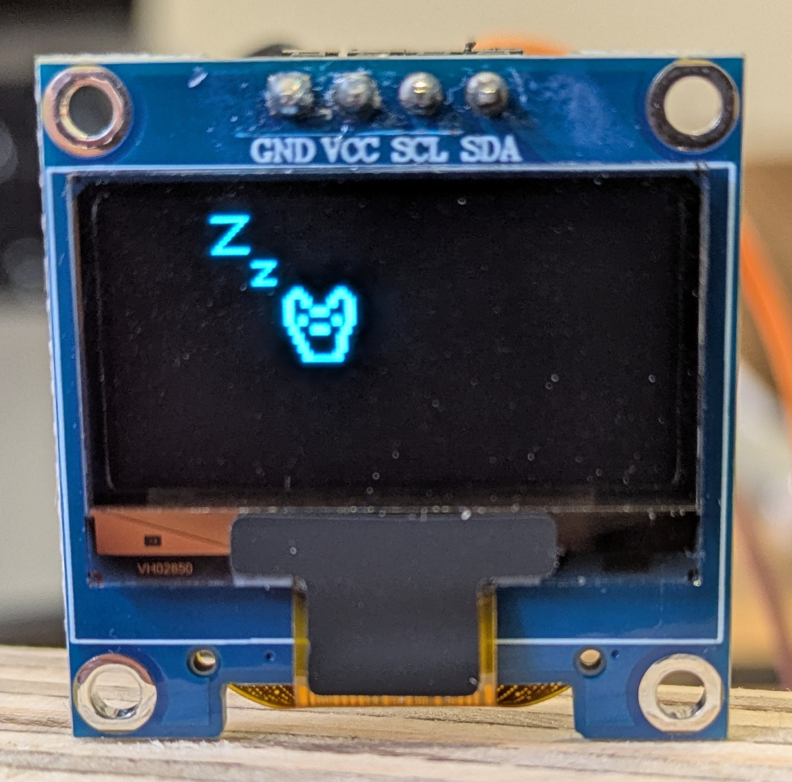
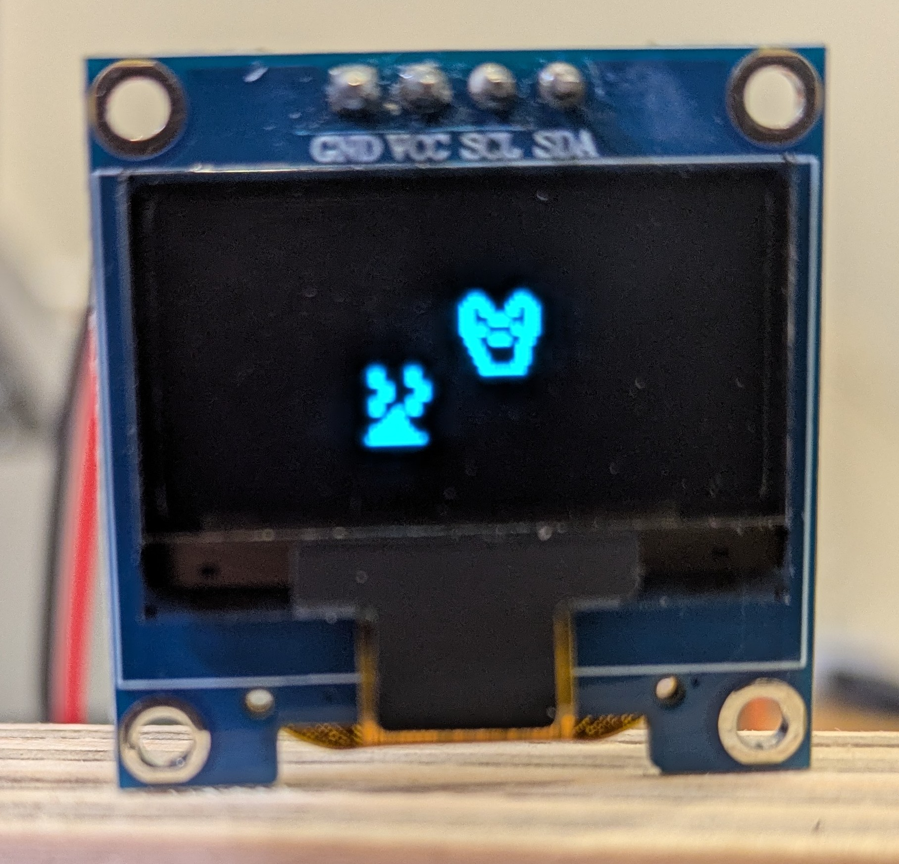

# STM32 Puppy Game

## Description
A small OLED game that involves controlling a puppy around, cleaning up its messes and waking it up from sleep.

This project demonstrates the use of a GME12864 OLED display connected via I2C to a STM32 NUCLEO-F411RE board, as well as enabling keyboard inputs via USART serial terminal to control the STM32. it includes hardware configuration and testing embedded communication via inputs to be shown on rendering.

## Key Technical Challenges
- Configuring USART to receive inputs via serial terminal
- Used modules to cleany manage workflow of code to show game processes
- Ensuring physical connections to hardware are managed properly and are stable
- Controlling OLED output to display intended images formatted properly

## Controls
W/A/S/D: Puppy movement
C: Clean poop (Must be on top of it)
Z: Wake puppy up

## Screenshots

<br>

<br>

## Build and Flash

``` bash
make clean
make
st-flash write build/stm32-puppy-game.bin 0x08000000
```

## Opening Serial Terminal

To send keyboard inputs to the STM32 we must communiate to it via the USART serial terminal. To do this, first use
``` bash
ls /dev/tty.*
```
You will see something like
``` bash
/dev/tty.usbserial-0001
/dev/tty.usbmodem14101
```
To open your Serial terminal, use
``` bash
screen /dev/tty.usbmodemXXXXX 115200
```
and replace the XXXXX with your serial port number. This opens the serial terminal, that will send keyboard inputs to the STM32.

## Tools and Technologies
- C – Firmware development
- arm-none-eabi-gcc – STM32 compiler
- st-flash / st-util – Flashing and debugging tools
- STM32CubeMX – Hardware configuration and code generation
- macOS – Development environment

## Further Improvements
- Improve module dependencies: e.g. input module returns value instead of directly calling game module
- Update sprites so they can have different sizes instead of being forced to have the same 16x16 shape.
- Consider creating a module to be able to scaled with multiple puppies/events at once.